# Mall för inlämning laboration 1, 1dv610

## Checklista

- [X] Jag har skrivit all kod och reflektioner själv. Jag har inte använt mig av andras kod för att lösa uppgiften.
- [x] Mina testresultat är skrivna utifrån utförd testning ( och inte teoretiskt, "det bör fungera" :) )
- [x] De enda statiska metoder eller funktioner utanför klasser som jag har är för att starta upp min testapplikation ex main(java).
- [x] De enda bibliotek och färdiga klasser som används är sådana som måste användas (eller som används för att testa modulen).

## Egenskattning och mål

- [ ] Jag är inte klar eftersom jag vet att jag saknar något. Då skall du inte lämna in!
- [x] Jag eftersträvar med denna inlämning godkänt betyg (E-D)
  - [x] De flesta testfall fungerar (enstaka testfall kan misslyckas, tydligt vilka)
  - [x] Koden är förberedd på återanvändning
  - [x] All kod samt historik finns i git
  - [x] Reflektionerna är skrivna
  - [x] Koden är läsbar
- [ ] Jag eftersträvar med denna inlämning högre betyg (C) och anser mig uppfylla alla extra krav för detta.
  - [ ] Jag är noga i min testning
  - [x] En del av testfallen är automatiserade (Tokenizer/Parser/PP), viss del kan vara manuellt testad.
  - [x] Det finns en tydlig beskrivning i hur mina moduler skall användas.
  - [ ] Mina reflektioner visar tydligt att jag förstått bokens koncept.
- [ ] Jag eftersträvar med denna inlämning högsta betyg (A-B)
  - [ ] Sammanhängande reflektion som ger ett gott helhetsintryck och visar detaljerad förståelse för kodkvalitet.
  - [ ] Min kod är ... (pussar fingrar och gör smackljud)
  - [ ] Extrauppgift parser finns med som egen modul(er)

Förtydligande: Examinator kommer sätta betyg oberoende på vad ni anser. Att ha "saker" från högre betygsnivåer verkar positivt och kan väga upp brister i inlämningen.

## Komponenter och återanvändning

- [Tokenizer](https://github.com/magink/tokenizer)
  - Används för att skapa tokens av en String som sedan parsern använder för att bygga meningar av. Tokenizern är uppdaterad efter önskemålen i feedbacken från Lab 1.
- [PrettyPrinter](https://github.com/magink/pretty-printer)
  - Formatterar meningarna som kommer från parsern.
- Det finns instruktioner och exempel på hur man använder parsern i [README.md](https://github.com/magink/parser/blob/main/README.md)
- Alla komponenter har egna repon, `PrettyPrinter` beror på `Parser` som i sin tur beror på Tokenizer via en token Adapter/Receiver. En användare kan t.ex. skriva en egen adapter som implementerar `TokenReceiver`.
- Jag har kört med Visual Studio Code's inbyggda (eller det som bundlas med Java Extension Pack) sätt att hantera dependancies. Jar-filer placeras i `lib` och de blir sedan tillgängliga att använda i projektet. Det merför ett manuellt steg att ladda ner och lägga till om man behöver uppdatera komponentent till en nyare version.

## Beskrivning av min kod

### Parser

Jag har en basklass, `Sentence`, som är en abstrakt klass som flera konkreta klasser ärver. `Sentence` innehåller  `Words` en struktur för ord och en markör `selectedWord` för valt ord. Sentence implenterar EndType som de konkreta typerna av meningar, Question, Statement och Exclamation, måste implementera.
`EndType` definerar två metoder för att kunna hämta symbolen och namnet för end typen.
Även en `toString()` defineras för att kunna få ut den hela meningen med efterföljande end type. `toString()` ska först anropa super.toString() innan end type symbolen läggs på.

Ingången för en användare är `Parser` klassen och `parse()` metoden, som har ansvaret att mata in tokens i `Document` och sen returnera `Document` när det inte finns fler tokens att hämta från tokenizern.
I `Document` sker själva parsningen av tokens.
Token typen läses av en token i taget. Är typen av `Word` skapas ett `Word` objekt och läggs till i datastrukturen `Words`. När en token typ påträffas, som matchar någon av de End Types jag definerat, Question, Statement, Exclamation, så skapas ett objekt av den typen och Words datastrukturen läggs till med `addWords()` i ett Sentence objekt. Sentence objectet läggs till i Sentences, också en datastruktur fast för meningar.
Detta upprepas till inga tokens längre matas in från Parser klassen.

Som ett interface mot Tokenizerna har jag en `TokenReceiver` som definerar två metoder, `public boolean next()` som stegar fram till nästa token och returnerar sant om token fanns, falsk om annat.
`public Token getToken()` returnerar det senaste token som hittades av tokenizer. Adapterklassen `TokenizerAdapter` implementerar interfacet och lägger till grammar mot min faktiska Tokenizer som är tillagd som ett library.

### PrettyPrinter

Skriver ut till Console med färgformattering med ANSI. Det finns en basklass `App.java` som sätter upp koden, skickar in beroenden och texten.
`PrettyPrinter` har en `print()` method som plockar ut sentences ur `Document` från `Parser` och printar ut dem med olika färger och formattering i privata metoder för varje typ av mening.
ANSI-koderna för färgerna har jag kopierat från StackOverflow och lagt i Colors klassen. Jag själv anser att detta är en okej tillämpning av kopiering då jag länkar till källan samt att det uteslutande är statiska färg-koder för console och ej någon logik.
Jag är medveten om att dessa är statiska för att jag ska kunna hämta dem utan att behöva instansiera ett Colors objekt, jag själv tycker att sättet jag använder dem på är okej då det ej är metoder.

## Hur jag testat

Pretty-printer har testats manuellt genom att granska utskriften.

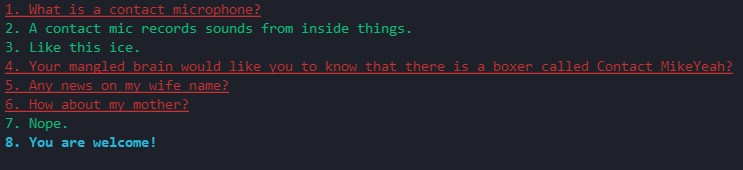

För `Parser` har jag använt junit 5 och skrivit automatiska tester. Dels en test klass för att säkerställa att mina adapter klass funderar mot min Tokenizer och sen en klass som testar samma tester som i laborations beskrivningen + några fler för mina olika typer. Test-klasserna ligger i ett annat källträd under samma paket som implementationen.

### Testfall

| Namn      | Indata | Förväntat Utfall | PASS/FAIL |
| --------- | ------ | ---------------- | --------- |
|  ShouldReturnCorrectWordFromStatement         |  I love parsers.      |    "love"             |   PASS        |
| shouldReturnTwoStatements | "I love parsers. They are fun."| 2 | PASS |
| shouldReturnExclamation | "I love parsers!" | Exclamation.TYPE | PASS |
| shouldReturnQuestion | "Do I love parsers?" | Question.TYPE | PASS |
| shouldReturnAllQuestions | "One question? Then another questions? But not this one. A final question?" | 3 | PASS |
| shouldReturnAllStatements | "This is a statement. No this is! Is it? Yes." | 2 | PASS |
| shouldReturnAllExclamations | "Bratan now is the time! Go away necktie. I only ever wanted you to have fun Harry! How did we meet?" | 2 | PASS |
| shouldReturnEntireSentence | "Bratan now is the time!" | "Bratan now is the time!" | PASS |
| shouldGetFirstTokenTypeWhenCreated | "You come at the king you best not miss." | "WORD" | PASS |
| shouldGetAnotherTokenTypeWhenHit | "You come at the king you best not miss." | "WORD" | PASS |
| shouldGetFirstTokenValueWhenCreated | "You come at the king you best not miss." | "You" | PASS |
| shouldGetNextTokenOnNext | "You come at the king you best not miss." | false | PASS |
| shouldGetLastTokenWhenHittingEdge | "You come at the king you best not miss." | END | PASS |

Screenshots från automatisk testning.
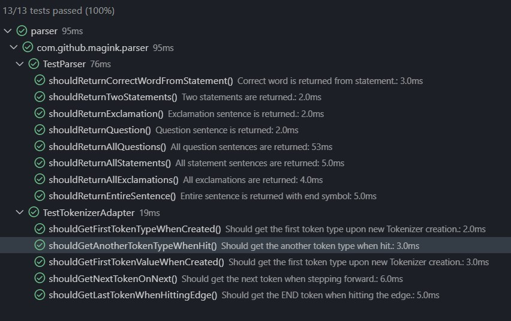

## Kapitelreflektioner för kapitel 2-11

### Kapitel 2

`Pick One Word per Concept` och att skriva meningsfulla och betydelsefulla namn på klasser och metoder har haft störst effekt på min kod. Att hitta rätt ord som inkapslar konceptet man vill förmedla i koden kräver att man måste ha förståelse för problemdomänen. Det reflekteras i mitt val att använda en abstrakt basklass `Sentence` för mina specifika typer av klasser, då många språk använder liknande klassifisering, e.g. påståendesats, Frågesats, Utropssats för att klassifieras meningar.

Att ta ett steg tillbaka och fundera perspektivet som användare av koden ser. Är `next()` tillräckligt tydligt, framförallt med tanke på att jag använder `getToken()` i nästa metod. Kanske hade det varit bättre med `nextToken()` för att lyfta fram subjektet?

### Kapitel 3

Att påminna mig själv om att gå tillbaka när "jag löst problemet" och se hur jag kan "städa upp", fundera över eventuella sidoeffekter och att separera olika typer av funktioner om det är ett Command eller Query och inte blanda dem. Att hålla funcktioner korta i största möjliga mån. Det är inte alltid lätt att följa då funktioner gärna växer medan man implementerar algoritmer och innan jag läst kursen gick jag direkt vidare på nästa problem istället för att komma tillbaka och "städa". En kvarleva att detta beteende är något som man kan se i `Parser` klassen där `parse()` vuxit till 17 rader trots att den inte är involverad alls egentligen. Inte heller gör koden en sak. Man skulle kunna bryta ur hela sentence objekt instansierandet till en egen metod.

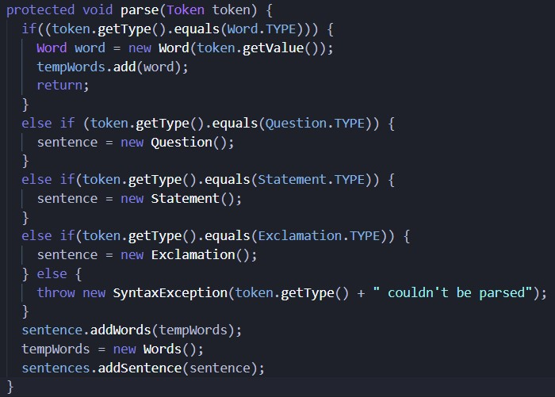

### Kapitel 4

Lärodomen jag fått från kapitlet är att jag nästan inte längre skriver kommenterer i koden, jag försöker först och främst förbättra kodens egna läsbarhet genom att ändra namn och returtyper.
De kommentarer jag fortfarande finner värde i är där jag tycker det kan finnas en förväntan av djupare förståelse, t.ex. att dokumentera antagaden kring ett interface som en användare kan implementera, där tycker jag ofta att en viss övertydlighet kan vara hjälpsamt t.ex. bifoga några exempel på förväntat returvärde och formattering. Det är inget som "kommer ivägen"
för koden i implementationen. Interfacet EndType nedan är ett exempel där jag förtydligat förväntat returvärde.

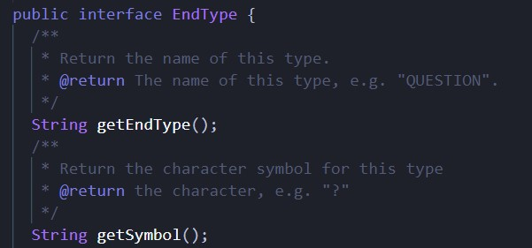

### Kapitel 5

Jag upplevde kapitel 5 som ett subjektivt kapitel och lärdomarna handlar mycket om att luta sig mot statistik för att hitta radavstånd, densitet, indentering och formattering som passar majoriteten, inte nödvändigtvis vad som passar bäst för det nuvarande projektet. Den lärdom jag funnit bäst använding av i mina egna projekt är att tänka med/i Newspaper Metaphor med målet att förmedla en eller flera "stories", först övergripande som specifieras ytterligare ju längre "ner" man går, för att göra koden lättare att läsa och förstå. Interfacet utåt specifieras högt upp i en klass där abstraktionerna hålls höga, ju längre ner i klassen man går desto mer primitiva blir metoderna som anroppas av överordnade metoder.
`Document` klassen blir min akilleshål i den aspekten, där det blivit en vild blanding mellan abstraktioner och duplicerad kod. Man kan ganska lätt fixa till den genom en privat metod längst ner som filtrerar Sentences till vald typ, men man får till viss del konflikt med ordningen av metoder, Vertical Ordering, att anropade metoder ska ligga under anrop. Jag starkt föredrar att ha privata metoder längst ner så i det här fallet skulle jag bryta mot vertical ordering för att kunna ha `protected void parse()` över den privata metoden.

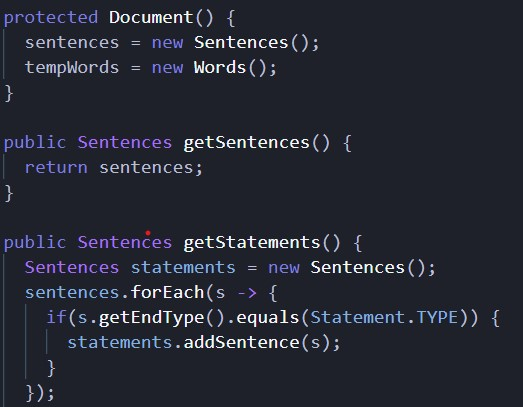

### Kapitel 6

Att skriva datastrukturer är som en inverterad dragkamp. Min kod tenderar att dra sig mot att det blir objekt med metoder för manipulation. `Words` klassen är ett exempel som jag ifrågasätter varför jag har den, en ArrayList av Word i Document hade kunnat lösa samma problem. Data Transfer Objects har jag inte använt med jag ser en potentiell möjlighet att Tokens i Tokenizern skulle kunna bli det, just nu är de i "bean"-form med privata variabler och accessors.

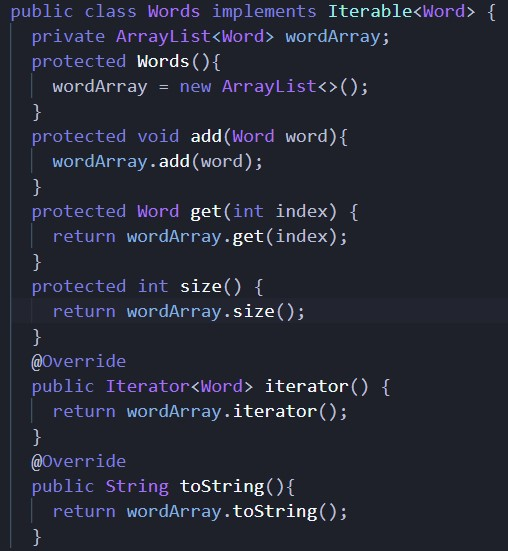

### Kapitel 7

Den största lärdomen jag tagit med mig är att unvika att returnera null så mycket det går, det finns Java-klasser som t.ex. Optional som kan indikera liknande mening men samtidigt tvingar utvecklaren att hantera ett saknad värde för att ej riskera nullpointerexception. Att använda unchecked exceptions istället för checked gör jag nästan uteslutande efter jag läst kapitelet, att få bort undantagssignaturen i metodhuvudet gör mycket för läsbarheten, t.ex. röran de skapade i testklassen på tokenizern. I parsern har jag ett SyntaxException som ärver RuntimeException, Javas basklass för unchecked exception.

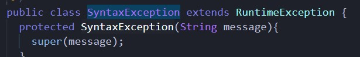

### Kapitel 8

Adapter och receiver klasserna är sättet jag har skapat en gräns mot min tokenizer. Interfacet TokenReceiver har två väldefinerade metoder `next()` och `getToken()`.
Dessa implementeras av TokenizerAdapter som skapar Tokenizern och åtropar metoderna för att stega och hämta tokens.
Vill jag eller någon annan använda en helt annan tokenizer med parsern så behöver förändringar bara ske i existerande adapterklass/eller en ny adapterklass.

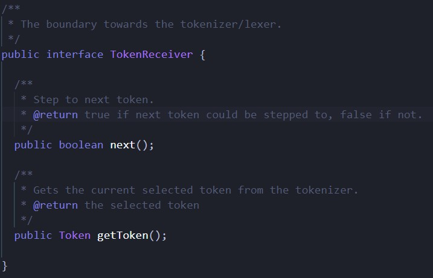

### Kapitel 9

Jag har använt junit 5 för mina enhetstester. Jag har två testklasser, en som testar adapterklassen och en som testar parsern. De är skrivna på olika sätt, testerna av adapterklassen använder one-liners med kedjeanropp medan parsern är mer vertikal där jag tydligt definerat input och förväntat utfall i början av testerna.Jag använder en assert per test och försöker endast testa ett koncept per test.
Det är mycket duplicering av kod i parser testerna och jag är inte helt nöjd med hur jag testar typerna av meningar, då asserten sker i en ForEach.
Risken finns att det bryta mot "one assert per test" om det sker flera iterationer.

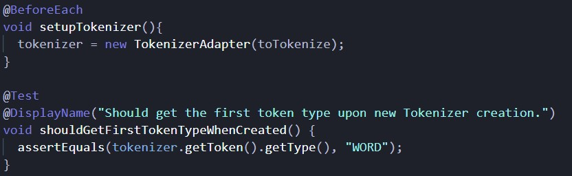
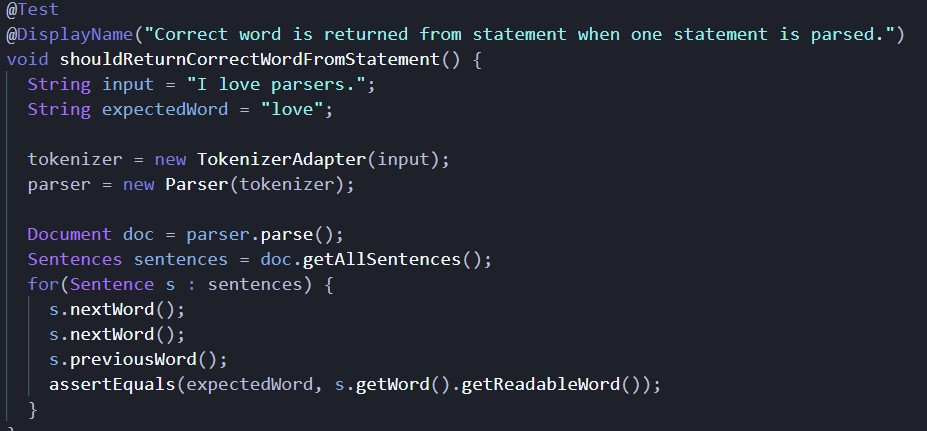

### Kapitel 10

Klasserna som ansvarar för typerna av meningar kan man argumentera för att de bryter mot Single Responsability Principle då det förutom att agera som noder i trädstrukturen, tillhandahåller den grammatik som tokenizern använder för att läsa ut tokens via publika statiska fält. Istället skulle jag kunnat skapat egna klasser för grammatiken i ett eget paket.
Jag bryter medvetet mot en princip, att publika metoder ska direkt följas av anropade privata metoder även om den publika metoden efterföljs av flera andra publika metoder.
Jag upplever att det blir mindre rörigt och skapar en bättre överblick över klassens "interface" utåt om åtkomstmodifieraren står överordnat anropsordningen, så att public följs av protected följs av private och att anropsordningen därefter tillämpas.  Mina klasser är organiserade efter Newpaper metaphor där de blir mer detaljerade och primtiva ju längre ner man läser i klassen.

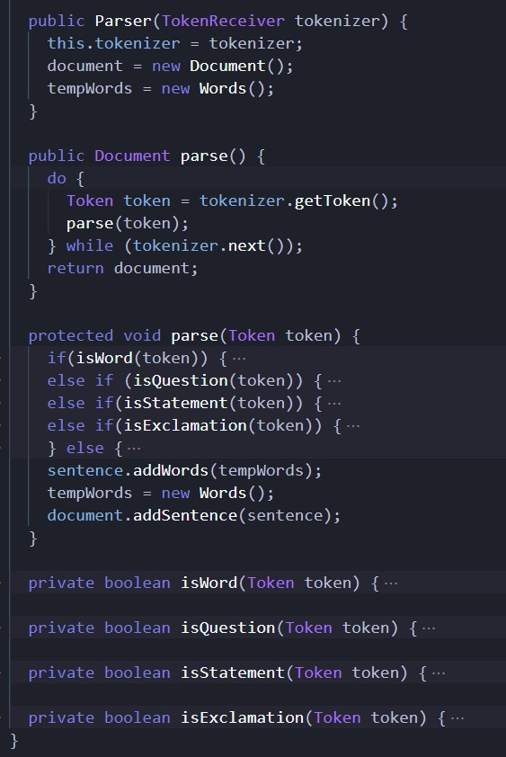

### Kapitel 11

PrettyPrinter har en `App.java` klass med `main()` metoden utanför paketet som skapar objekten som PrettyPrinter beror på och skickar in dem i konstruktorn. Dependency injection finns i parsern där jag skapar och skickar in TokenizerAdapter objektet utanför t.ex. som i test-klasserna. Inte optimalt då det kanske vore bättre att centralisera objekt setupen i en egen klass istället för main() metoden.

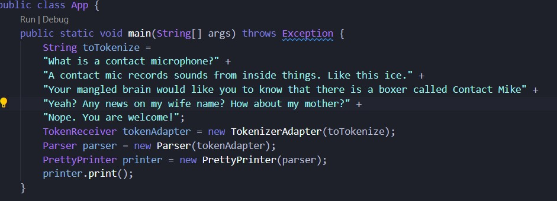

## Laborationsreflektion

För att få in uppgiften innan sista deadline så lämnar jag in en lösning som visserligen fungerar, men som jag är missnöjd över. Jag känner att jag utvecklades mer under lab 1 där jag hade mer tid att jobba med bokens lärdomar och polera min kod mer, istället för att stressa runt i cirklar kring build tools och logik som jag ändå inte kunde få till i slutändan.

Parsern har överlag varit svår jämfört med Tokenizern. Om tokenizern är 4/10 i svårhet så är parsern 8/10. Att skaffa sig förståelse för problemet sätter iväg en mot litteratur om kompilatordesign, Natural Language Processing och liknande, vilket jag upplevde som så omfattande att det nästan skulle krävas en helt egen kurs.
Känner inte att jag fick parsern att fungera på det sätt som jag tycker den borde fungerat, den hade blivit betydligt mer avskalad och snyggare med rekursion men jag löste aldrig backtracking på ett bra sätt i tid och det kändes bara svårare ju mer tid jag la på det. Jag lade mycket tid på att förjäves få Maven/Gradle att fungera med egna dependancies då jag hade en vag tanke om att den kunde byggas direkt från Github repot och jag skulle slippa det manuella steget med att lägga jar-filer.

Kapitel 2-4, 6-9 har jag upplevt som mycket lärorika och som direkt haft påverkan på koden jag skrivit i projektet, framförallt hur man ska tänka kring namngivning av variabler, funktioner och klasser. Det är något som jag ser tydlig skillnad i mina projekt före respektive under och efter kursen.
Att även våga gå tillbaka till kod som "inte känns rätt" eller upplevs som för diffus och skriva om. Jag upplever att det blir bättre kod när man skriver om koden efter man löst problemet, hjärnan jobbar liksom i olika tillstånd där det mer kreativa problemlösartillståndet inte nödvändigtvis fungerar med editeringtillståndet.
Jag känner att jag skulle behöva göra en större djupdykning i datastrukturer då det är vad jag upplevt som svårast att få till rätt "tänk". Code Reviews behöver jag utsätta mig mer för, det är nyttigt för min kod.
